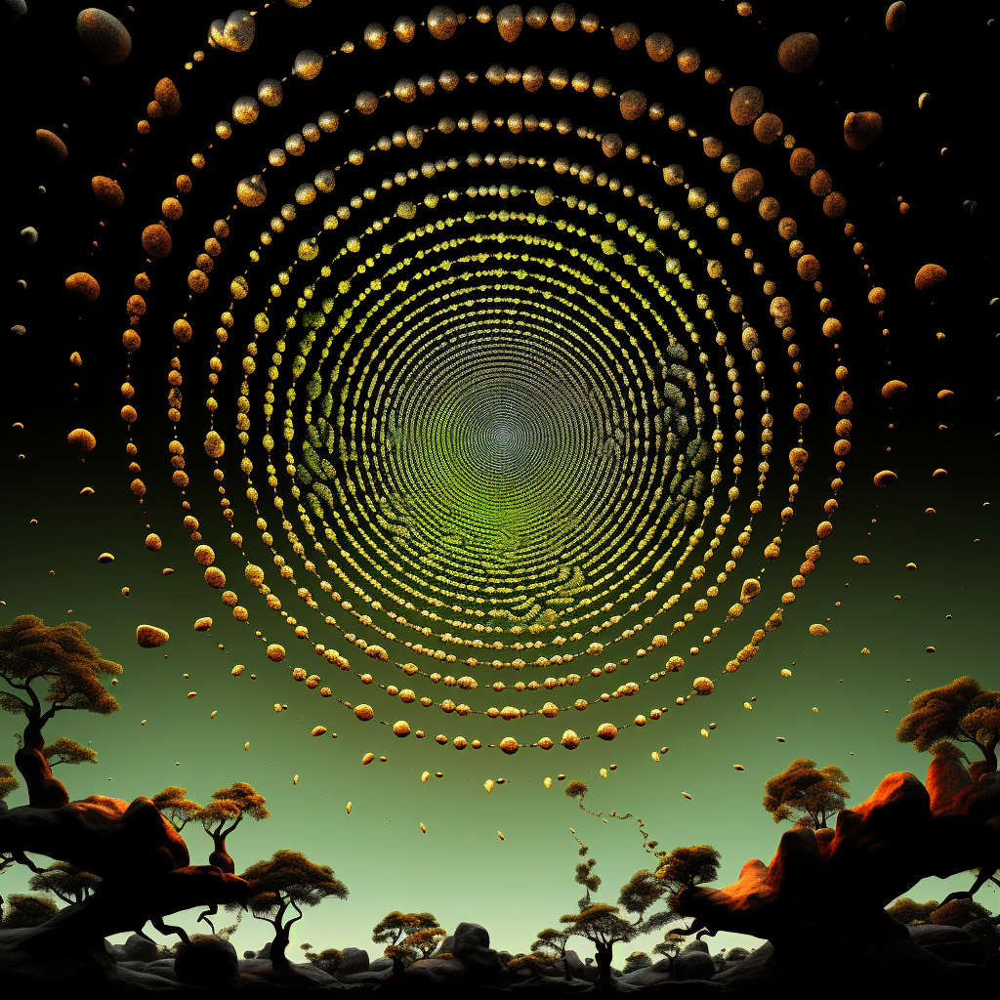

# yjia0704_9103_TUT6

## part1: Imaging Technique Inspiration
A circle is created by spirals surrounding the world, in the style of digital fantasy landscapes, dark gold and green, luminous spheres, psychedelic realism, infinity nets, precisionism influence, surreal 3d landscapes.The color gradient from the inner circle to the outer circle has a clear hierarchy. The small circle is used as an arc to generate a large circle, making the artwork more full. From here on, I can add these elements to make my artwork more mysterious and abstract, giving people a sense of shock, surrealism, and mystery, and taking the artwork to the next level. 

## part2: Coding Technique Exploration
This JavaScript code generates a captivating visual pattern using ellipses. 
 with each ellipse having a position determined by polar coordinates (r * cos(a) and r * sin(a)). The a angle varies based on the angle growth factor, while r depends on the square root of n. This combination creates a spiraling effect.
The ellipses are filled with colors that change based on the radius (r) of each ellipse. The colorMode function is used to control the color scheme. resulting in a visually appealing gradient effect.
 The pattern is dynamic and continuously evolving due to the changing angle growth factor.

[Code Link](https://editor.p5js.org/NC_Productions/sketches/Ui4ns_1c-)